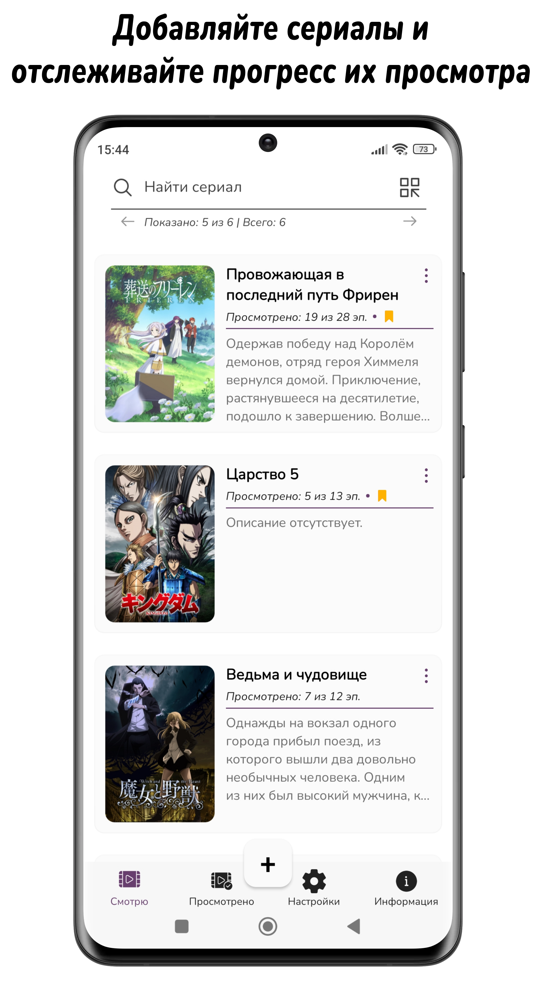
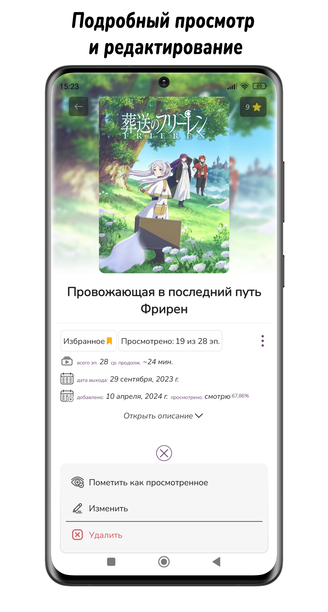
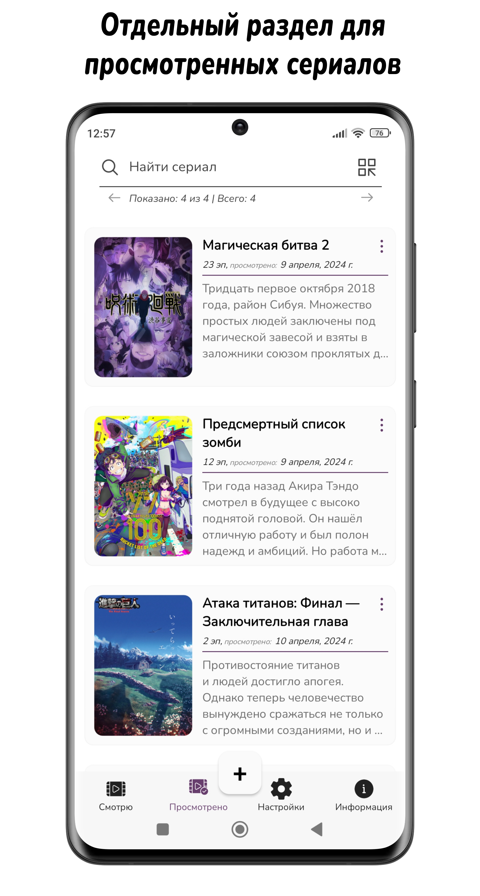
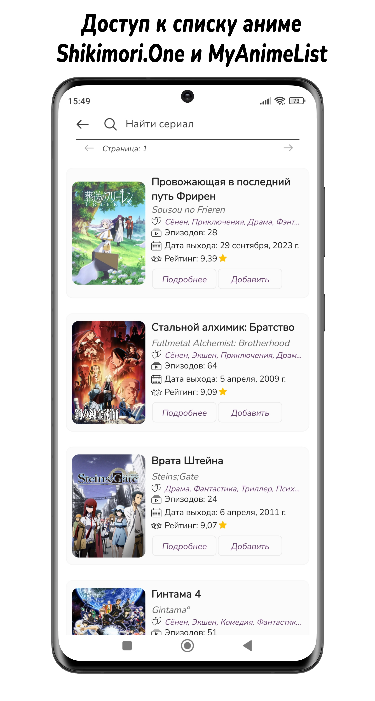
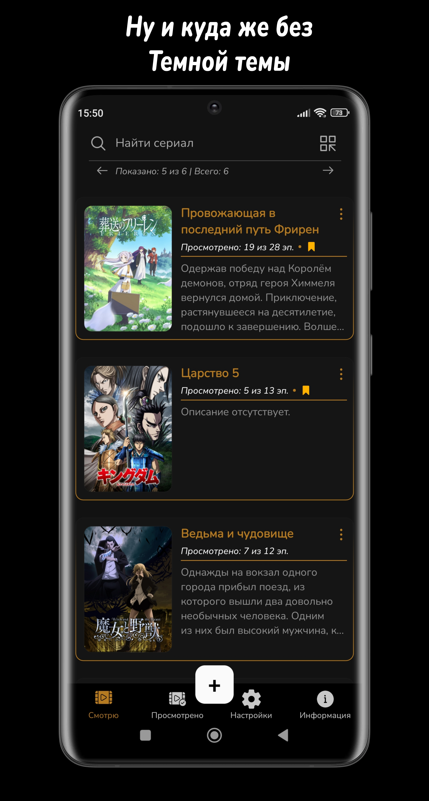

<h1 align="center">
    
    <br />
    <b>Series Tracker | Minimal application for tracking watched series</b>
</h1>

<p align="center">
    <a href="#зачем">Зачем?</a>
    •
    <a href="#функциональность">Функциональность</a>
    •
    <a href="#скриншоты">Скриншоты</a>
    •
    <a href="#использование">Использование</a>
    •
    <a href="#roadmap">RoadMap</a>
    •
    <a href="#архитектура">Архитектура</a>
    •
    <a href="#лицензия">Лицензия</a>
</p>

## Зачем?

<p>
Как и многие из нас, я люблю смотреть сериалы (в основном аниме), но по разным причинам мне приходится смотреть их на разных сайтах и я не очень хочу заводить аккаунт на каждом из них, чтобы отслеживать свой прогресс. 
 
Кроме того, у меня часто бывают длительные перерывы между просмотром чего-либо и я забываю, на каких сериях остановился. 

Чтобы как-то решить эту проблему и перестать делать заметки в своем приложении для заметок, я разработал простое приложение для Android, позволяющее отслеживать просмотренные эпизоды определенного сериала.

Также мне хотелось более подробно познакомиться с .NET MAUI и мобильной разработкой в целом.
</p>


## Функциональность


### Общее
<ul>
    <li>Темная/светлая/системная темы;</li>
    <li>Минималистичный и современный дизайн.</li>
</ul>

### Сериалы
<ul>
  <li>Добавление сериалов и отслеживание просмотренных эпизодов;</li>
  <li>Быстрый доступ к редактироваю/удалению;</li>
  <li>Пометка сериалов как "избранное";</li>
  <li>Поиск и фильтр по избранному;</li>
  <li>Раздельные экраны для активных и просмотренных сериалов;</li>
  <li>Возможность добавлять сериалы с сайта Shikimori.One.</li>
</ul>

### Хранение данных
<ul>
  <li>Экспорт/импорт данных в формате .json;</li>
  <li>Все данные хранятся локально на устройстве;</li>
</ul>

### Дополнительные функции
<p>В проекте реализованы нижеперечисленные дополнительные функции. Для их использования ознакомьтесь с разделом  <a href="#использование">Использование</a>.</p>
<ul>
  <li>Авто-поиск изображения для сериала;</li>
  <li>Возможность добавлять сериалы с сайта MyAnimeList;</li>
  <li>Хранение данных в облачном сервисе FireBase;</li>
  <li>Синхронизация между локальным и облачным хранилищами.</li>
</ul>

## Скриншоты

<details>
  <summary>Нажмите, что открыть скриншоты</summary>

<div>
</br>
    <p align="center">
      
      
      
    </p>
    <p align="center">
      
      
      
    </p>
    <p align="center">
        
    </p>
  </div>
</details>

## Использование

В этом разделе поясняется, как использовать `Дополнительные функции` приложения, описанные в <a href="#функциональность">Функциональность</a>. </br>
Если дополнительные функции вам не нужны, пожалуйста, ознакомьтесь с разделом `Releases` данного репозитория. В нем присутствуют .apk файл и исходный код приложения, в котором `Дополнительные функции` отсутствуют. Также в репозитории присутствует дополнительная ветвь `Restricted` с вырезанными функциями.

Для использования всех функций приложения необходимо сделать следующее:
    <ol>
    <li>
      В приложении реализовано хранение данных в облачном сервисе Google FireBase. Для доступа к этой функции вам необходимо создать проект в [Google Firebase console](https://console.firebase.google.com), 
      после чего использовать полученные ссылку на проект и Database Secret Key в `App.xaml.cs` следующим образом: <br />
```

FirebaseSettings(appSecret: "your_database_secret", baseUrl: "your_projecturl");

```
</li>
<li>
  
  В приложение используются API сайтов [Shikimori.One](https://shikimori.one/) и [MyAnimeList](https://myanimelist.net/) для получения данных. Shikimori API не требует любого вида аутентификации, так как используется
  [GraphQL](https://shikimori.one/api/doc/graphql). MyAnimeList API требует базовой аутентификации приложения, для этого требуется создать [MAL ID](https://myanimelist.net/apiconfig), после чего использовать его в `MALBase.cs` следующим образом: <br />
 
  ```
  
  _httpClient.DefaultRequestHeaders.Add("X-MAL-CLIENT-ID", "your_mal_id");
  
  ```
</li>
<li>
  
  В приложении реализована функция подбора изображения добавляемого сериала по его названию посредством Google Custom Search API. Чтобы использовать данную функцию необходимо создать 
  [Программируемую поисковую систему](https://programmablesearchengine.google.com/controlpanel/all) и проект в [Google Console Cloud](https://console.cloud.google.com), после чего использовать `идентификатор поисковой системы` и `ApiKey` проекта в файле
  `GoogleCustomSearchApiService.cs` следующим образом:

  ```
 var searchService = new Google.Apis.CustomSearchAPI.v1.CustomSearchAPIService(new BaseClientService.Initializer
            {
                ApiKey = "your_apiKey"
            });

```
```

 var listRequest = searchService.Cse.List();
            listRequest.Cx = "your_search_engine_id";

```
</li>
</ol>


## RoadMap

<ul>
    <li>Так как с момента релиза приложения я им активно пользуюсь, то первоочередной задачей является исправление всяческих ошибок и багов, если таковые будут найдены в процессе использования.</li>
</ul>

## Архитектура

#### Приложение создано на языке C#.

Приложение использует чистую архитектуру с шаблоном проектирования MVVM и разделено на 3 основных уровня.

## Лицензия

Series Tracker распространяется на условиях лицензии Apache (версия 2.0). Подробности в [Лицензия](LICENSE.txt).
